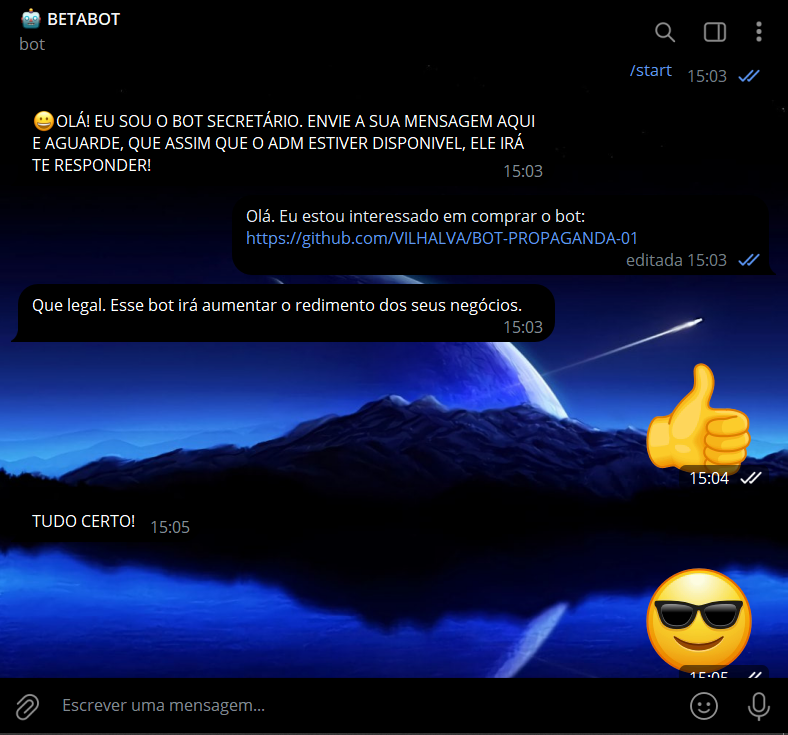
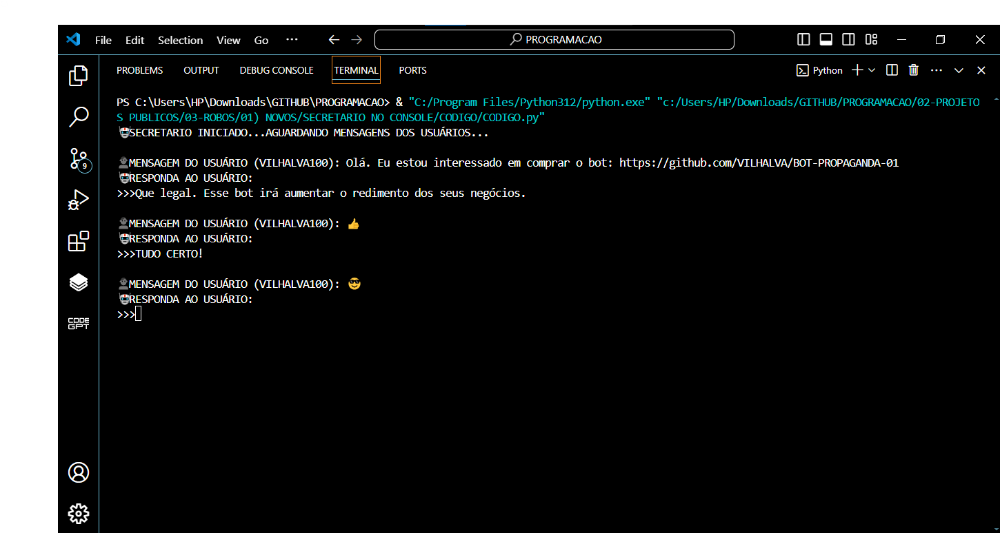
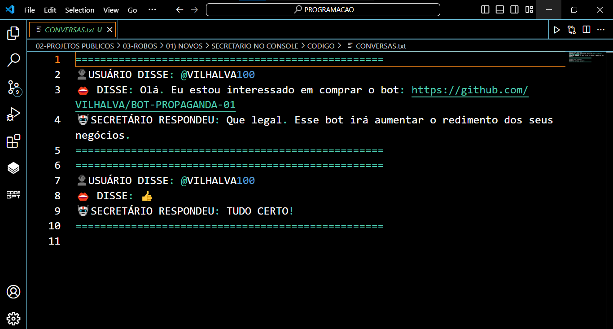

# SECRETARIO NO CONSOLE
🤤É UM BOT DO TELEGRAM PROJETADO PARA FUNCIONAR COMO UM INTERMEDIÁRIO ENTRE USUÁRIOS E UM ADMINISTRADOR.

 <br>
 <br>
 <br>

## DESCRIÇÃO:
O **Bot Secretário** é um bot do Telegram projetado para funcionar como um intermediário entre usuários e um administrador. Ele permite que mensagens enviadas pelos usuários no chat privado do bot sejam exibidas no console do administrador. O administrador pode então responder diretamente do console, e a resposta será enviada de volta ao usuário através do bot. Além disso, todas as conversas são registradas em um arquivo de texto (`CONVERSAS.txt`).

Este bot é ideal para situações onde um administrador precisa gerenciar e responder a mensagens dos usuários de forma organizada, garantindo que todas as interações sejam registradas para referência futura.

## FUNCIONALIDADES:
1. **Recebimento de Mensagens dos Usuários**:
    - Os usuários podem enviar mensagens diretamente para o bot no Telegram.
    - Quando o bot recebe uma mensagem, ela é exibida no console do administrador.

2. **Saudação Inicial**:
    - Quando um usuário envia o comando "/start", o bot responde automaticamente com uma mensagem de boas-vindas:
        - "😀OLÁ! EU SOU O BOT SECRETÁRIO. ENVIE A SUA MENSAGEM AQUI E AGUARDE, QUE ASSIM QUE O ADM ESTIVER DISPONIVEL, ELE IRÁ TE RESPONDER!"
    - A mensagem "/start" não é registrada no console nem no arquivo de texto.

3. **Resposta do Administrador**:
    - O administrador visualiza a mensagem do usuário no console e pode digitar uma resposta.
    - A resposta do administrador é enviada de volta ao usuário através do bot.
    - As conversas (mensagem do usuário e resposta do administrador) são registradas em um arquivo de texto para referência futura.

4. **Registro de Conversas**:
    - Todas as conversas são registradas no arquivo `CONVERSAS.txt`, incluindo o nome de usuário e a mensagem original.

5. **Mensagens em Ordem**:
    - O bot processa uma mensagem por vez, garantindo que o administrador responda a uma mensagem antes de receber a próxima. Isso é facilitado pela API do Telegram, que mantém as mensagens em ordem e permite que o bot recupere mensagens não processadas mesmo quando estiver offline.

## AVISO:
- **Mensagens em Ordem**: O bot só permite ver as próximas mensagens se as anteriores forem respondidas. A API do Telegram ajuda a garantir que nenhuma mensagem se perca quando o bot estiver offline, processando as mensagens na ordem em que foram recebidas uma vez que o bot estiver online novamente.
- **Encerramento do Bot**: Para encerrar o bot, você pode parar a execução do script Python.

## EXECUTANDO O PROJETO:
1. **Coloque o Token:**
   - Antes de executar o programa, é necessário substituir o token do seu bot no arquivo `TOKEN.py`, o qual pode ser obtido por meio do [@BotFather](https://t.me/BotFather).

2. **Instalando as dependências:**
   - Antes de executar o bot, certifique-se de instalar todas as dependências necessárias. No terminal, execute o seguinte comando para instalar as dependências listadas no arquivo `requirements.txt` em `CODIGO`:
   ```bash
   pip install -r requirements.txt
   ```

3. **Inicie o Bot:**
   - Execute o bot do Telegram em Python iniciando-o com o seguinte comando:
   ```bash
   python CODIGO.py
   ```
   
4. **Interagindo com o Bot:**
    1. **Interação com Usuários**:
        - Os usuários enviam mensagens para o bot no Telegram.
        - Quando o bot recebe uma mensagem, ela é exibida no console:
            ```plaintext
            👤MENSAGEM DO USUÁRIO (username): Mensagem recebida
            ```
        - O administrador deve digitar uma resposta no console:
            ```plaintext
            🤖RESPONDA AO USUÁRIO:
            >>> Sua resposta aqui
            ```

    2. **Resposta e Registro**:
        - A resposta do administrador é enviada ao usuário.
        - A conversa completa é registrada no arquivo `CONVERSAS.txt`:
            ```plaintext
            ==================================================
            👤USUÁRIO DISSE: @username
            👄 DISSE: Mensagem recebida
            🤖SECRETÁRIO RESPONDEU: Sua resposta aqui
            ==================================================
            ```

    3. **Tratamento de "/start"**:
        - Quando um usuário envia "/start", o bot responde automaticamente com uma mensagem de boas-vindas e ignora essa interação no console e no arquivo de texto.

## NÃO SABE?
- Entendemos que para manipular arquivos em muitas linguagens e tecnologias relacionadas, é necessário possuir conhecimento nessas áreas. Para auxiliar nesse aprendizado, oferecemos alguns subsidios:
* [VEJA A DOCUMENTAÇÃO](https://core.telegram.org/bots/api)
* [CURSO DE PYTHON](https://github.com/VILHALVA/CURSO-DE-PYTHON)
* [CURSO SUGERIDO](https://github.com/VILHALVA/CURSO-DE-TELEBOT)
* [CONFIRA MAIS CURSOS](https://github.com/VILHALVA?tab=repositories&q=+topic:CURSO)

## CREDITOS:
- [PROJETO INSPIRADO NO "CHAT DE CONVERSAS EM TXT"](https://github.com/VILHALVA/CHAT-DE-CONVERSAS-EM-TXT)
- [PROJETO FEITO PELO VILHALVA](https://github.com/VILHALVA)
